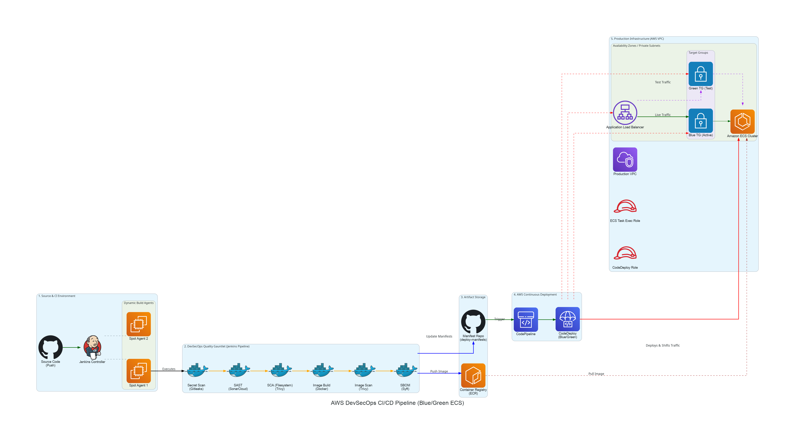
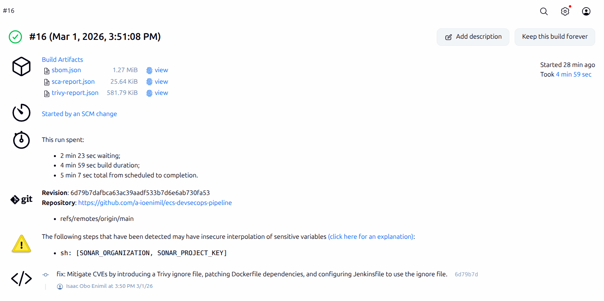
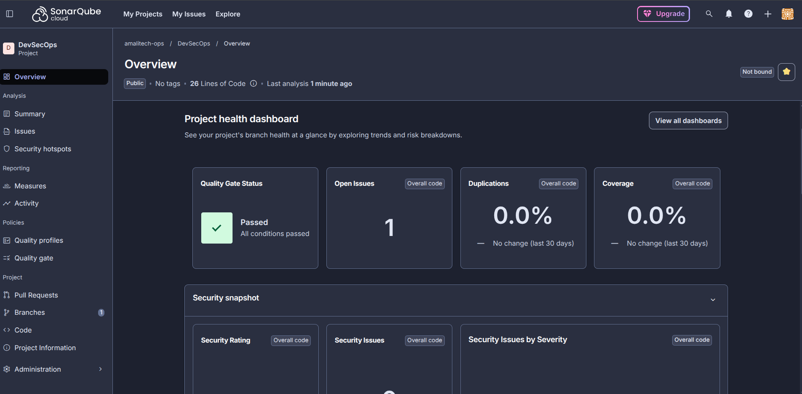
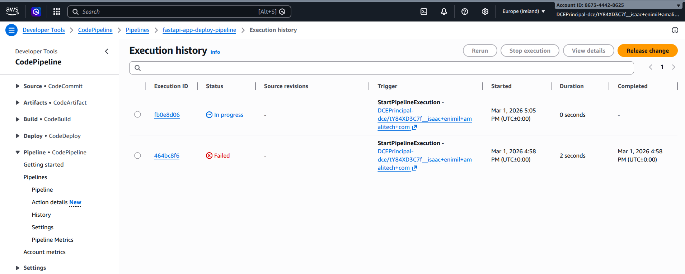
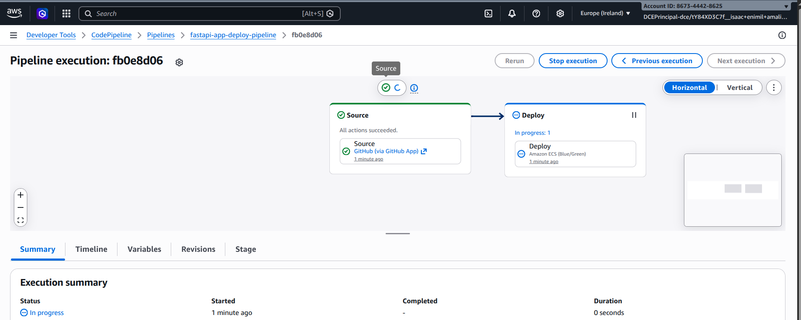
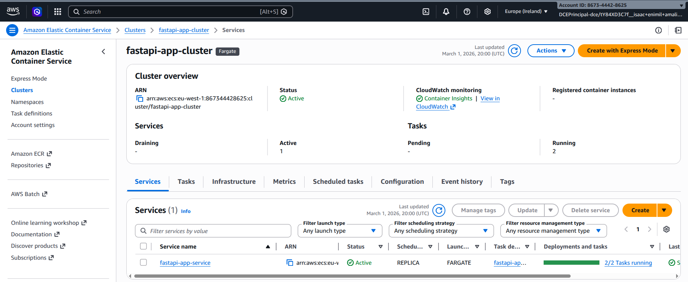

# AWS DevSecOps CI/CD Pipeline (Blue/Green Deployment)

## 📌 Overview

This project implements a robust, secure, and highly available Continuous Integration and Continuous Deployment (CI/CD) pipeline on AWS. It uses **Jenkins** (with dynamic EC2 Spot Instances) to run a comprehensive **DevSecOps Quality Gauntlet**, ensuring that only secure and verified code is packaged into Docker images and pushed to Amazon ECR. 

The deployment strategy is built around complete automation: pushing a new approved image URI to a deployment manifests repository triggers **AWS CodePipeline**, which orchestrates a **Blue/Green Deployment** to an **Amazon ECS Cluster** via **AWS CodeDeploy**.

---

## 🚀 Key Features

*   **Dynamic Jenkins Build Agents**: Uses the EC2 Fleet plugin to spawn cost-effective Spot Instances on-demand for Jenkins build jobs, terminating them gracefully when idle.
*   **DevSecOps Quality Gauntlet**:
    *   **Secret Scanning**: Gitleaks prevents hardcoded credentials from entering the codebase.
    *   **SAST (Static Application Security Testing)**: SonarCloud performs deep code analysis to catch bugs and vulnerabilities.
    *   **SCA (Software Composition Analysis)**: Trivy scans dependencies (e.g., Python packages) for CVEs.
    *   **Container Security**: Trivy is used again to scan the final built Docker image before it's pushed to the registry.
    *   **SBOM Generation**: Syft generates a comprehensive Software Bill of Materials (CycloneDX JSON) for supply chain transparency.
*   **Immutable Infrastructure & GitOps**: Jenkins builds the image and programmatically updates a deployment manifests repository, automatically triggering AWS CodePipeline.
*   **Zero-Downtime Blue/Green Deployment**: CodeDeploy safely shifts traffic at the Application Load Balancer (ALB) level from the old (Blue) ECS task set to the new (Green) task set.

---

## 🛠️ Pipeline Stages Walkthrough

### 1. Continuous Integration (The Quality Gauntlet)
Every code push initiates the automated Jenkins pipeline. The source code and final container are aggressively scanned for security flaws. The pipeline publishes all artifacts (SCA reports, SBOM, Trivy reports) automatically.

**SonarCloud Integration:**
The SAST step connects directly to SonarCloud, providing an external quality gate that must pass for the build to continue.

### 2. Continuous Deployment Trigger
Once the image passes all tests and is pushed to Amazon ECR, Jenkins makes an authenticated Git commit to the secondary deployment manifests repository. This commit updates the Task Definition with the new container image URI, which immediately triggers AWS CodePipeline.

### 3. Blue/Green Deployment (CodeDeploy)
AWS CodePipeline hands the process over to AWS CodeDeploy. CodeDeploy spins up the new "Green" ECS task set alongside the existing "Blue" set. It routes test traffic to the new instances for verification before officially shifting the live production traffic over.

### 4. Active Production Workload
Once the deployment is deemed successful and healthy, the previous "Blue" task set is drained, and the new ECS tasks serve 100% of live user traffic perfectly. 

---

## 📁 Repository Structure
*   `Jenkinsfile`: The declarative Groovy CI pipeline definition containing the entire DevSecOps toolchain execution logic.
*   `backend/`: Application source code (FastAPI) complete with a `Dockerfile`.
*   `infrastructure/`: Modular Terraform configuration building out the complete VPC, Networking, ECS Cluster, CodePipeline, CodeDeploy, Load Balancers, IAM Roles, and Security Groups.
*   `diagram-engine/`: A Python-based `diagrams` script used to generate an industry-standard, right-angled architectural diagram defining the solution.
*   `assets/images/`: Screenshots, build reports, and architecture diagrams documenting the pipeline execution and AWS states.

---

## ⚙️ Prerequisites & Setup

1.  **AWS Account**: An active AWS environment to host the ECS infrastructure and provide CodePipeline/CodeDeploy integration.
2.  **Jenkins Server**: A functioning Jenkins Controller.
    *   *Plugins Required*: EC2 Fleet, SSH Agent, Pipeline, SonarQube Scanner.
3.  **SonarCloud Account**: Ensure your SonarQube tokens and project details are added to Jenkins Credentials (`sonarcloud-token`, `sonarcloud-project-key`, `sonarcloud-organization`).
4.  **Jenkins Credentials Matrix**:
    *   `deploy-manifests-repo-url` (Global Secret Text): The deployment manifest repository URL to trigger CodePipeline.
    *   `deploy-git-credentials-id` (Username/Password): GitHub / Git PAT credentials with write access to the deployment repo.
5.  **Terraform**: Run `terraform init`, `terraform plan`, and `terraform apply` within the `/infrastructure` directory to provision the AWS ecosystem.
